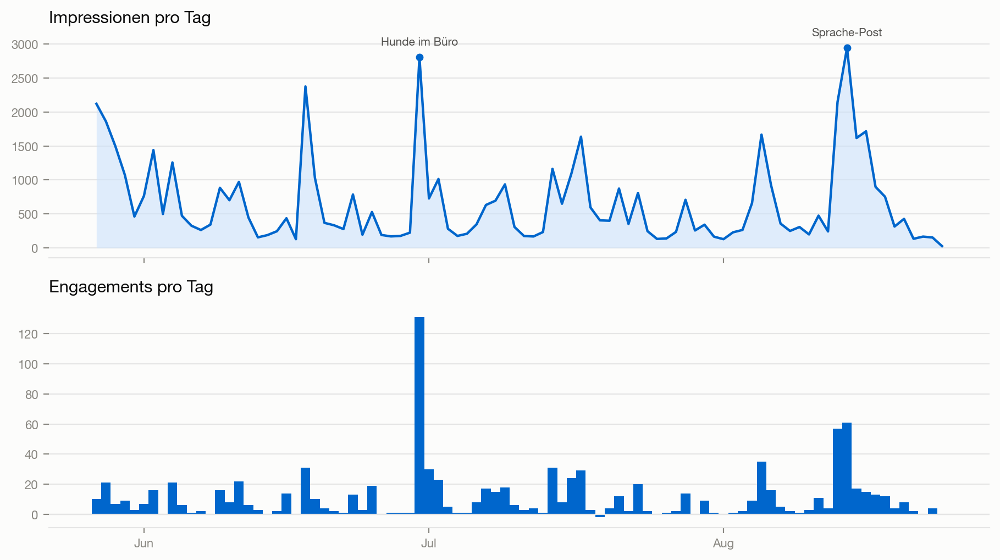
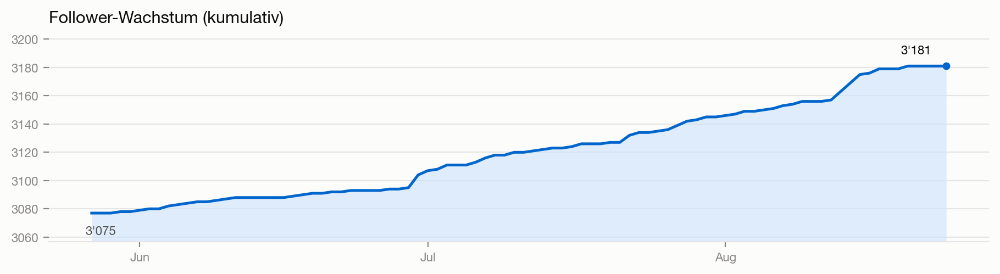
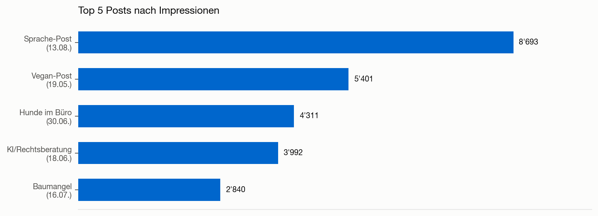
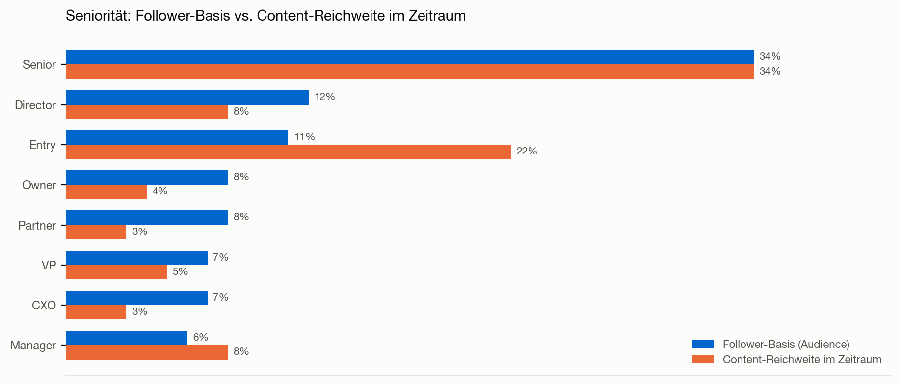

# LinkedIn Performance Report — David W. Frei (SEQUOIA Legal & Advisory)

**Zeitraum:** 27.05.2026 – 24.08.2026 (90 Tage) · **Erstellt am:** 25.08.2026 · **Erstellt von:** DungeonMasterAlex · **Datenquelle:** LinkedIn Analytics Export + Post-Volltexte + Kommentar-Export (manuell)

---

## Key Takeaways

- **Zwei Content-Ereignisse tragen die Reichweite überproportional:** Der Sprache-Post (13.08.) und «Hunde im Büro» (30.06.) allein liefern 22% aller Impressionen und 33% aller Engagements im Zeitraum — bei nur 2 von 34 Beiträgen. Das ist kein breiter Content-Sockel, sondern eine Abhängigkeit von einzelnen Treffern.
- **Die "echte" Baseline-Performance liegt unter der Schlagzeile:** Rechnet man die drei stärksten Tage (30.06., 13.–14.08.) heraus, sinkt die Engagement Rate von 1.63% auf 1.40%. Das ist immer noch solide für B2B-Rechtsberatung, aber die Gesamtzahl beschönigt die Konstanz.
- **Content-Reichweite ist deutlich junior-lastiger als die Follower-Basis:** Entry-Level macht 22% der Content-Reichweite aus, aber nur 11% der Follower-Basis — die viralen Posts holen also tendenziell ein jüngeres, weniger entscheidungsbefugtes Publikum als die eigentliche Zielgruppe.
- **Postingfrequenz liegt bei ca. 2.6 Beiträgen/Woche** — am unteren Rand dessen, was für konstante algorithmische Reichweite auf LinkedIn empfohlen wird (Richtwert 3–5×/Woche für Personal-Branding-Kanäle).
- **Bau-/Immobilienrecht-Content aktiviert nachweislich die unterrepräsentierte Zielgruppe** (Construction/Real Estate: 10% Content-Reichweite vs. 7% Follower-Basis) — der bislang einzige Beleg im Datensatz, dass gezielter Fachcontent die Zusammensetzung des Publikums tatsächlich verschieben kann.

---

## 1. Executive Summary

Im Zeitraum 27.05.–24.08.2026 (90 Tage) erzielte der LinkedIn-Auftritt von David W. Frei 59'116 Impressionen, 20'874 erreichte Mitglieder und 965 Interaktionen (Ø Engagement Rate 1.63%). Die Followerbasis wuchs von rund 3'075 auf 3'181 (+106, +3.4%), mit sichtbarer Beschleunigung im August.

Zwei Beiträge trugen überproportional zum Ergebnis bei: «Hunde im Büro — ein Evergreen» (30.06., 168 Interaktionen, stärkster Post im Zeitraum, mit Bürohunden Zazou und Nala) und ein Beitrag über die Abkehr von komplizierter Juristensprache (13.08., 8'693 Impressionen, stärkste Reichweite). Beide sind keine Zufallstreffer: Die Diskussionen in den Kommentarspalten zeigen, dass sie exakt die Markenkern-Aussagen aus dem Kundenprofil bestätigen — «verständliche Kommunikation» und «Nahbarkeit» werden vom Publikum aktiv eingefordert und honoriert, nicht nur passiv konsumiert.

Die kritische Kehrseite: Diese zwei Posts tragen 22% der Impressionen und 33% der Engagements bei nur 2 von 34 Beiträgen. Ohne die drei stärksten Tage liegt die Engagement Rate bei 1.40% statt 1.63% — die Grundlast ist solide, aber der Kanal hängt aktuell stärker an einzelnen Treffern als an einer breiten, verlässlichen Content-Basis. Auf Tagesbasis zeigt sich sonst eine stabile Entwicklung über den Sommer: Juni bis August liegen bei Ø 520–708 Impressionen/Tag und einer Engagement Rate von 1.66–1.81%.

Die Zielgruppe stimmt bei Seniorität und Unternehmensgrösse insgesamt gut mit dem Kundenprofil überein, ist geografisch jedoch stark auf Zürich fokussiert. Ein differenzierterer Blick zeigt zudem: Die Content-Reichweite im Zeitraum ist deutlich junior-lastiger (22% Entry-Level) als die stabile Follower-Basis (11%) — die viralen Momente erreichen tendenziell ein breiteres, aber weniger seniores Publikum als die eigentliche Zielgruppe der Geschäftsleitungen und Verwaltungsräte.

---

## 2. Kennzahlen-Übersicht

| Kennzahl | Wert |
|---|---|
| Follower (aktuell, 24.08.2026) | 3'181 |
| Follower-Wachstum im Zeitraum | +106 (ca. +3.4%, von ~3'075 auf 3'181) |
| Connections (total) | Keine Daten |
| Profilaufrufe | Keine Daten |
| Impressionen gesamt (alle Beiträge) | 59'116 |
| Mitglieder erreicht (unique reach) | 20'874 |
| Engagements gesamt | 965 |
| Ø Engagement Rate (Engagements / Impressionen) | 1.63% |
| Ø Engagement Rate ohne die 3 stärksten Tage | 1.40% |
| Beiträge mit Analytics im Zeitraum | 34 (≈ 2.6 Beiträge/Woche) |

Der Tagesverlauf macht die Konzentration auf zwei Ereignisse sichtbar: Ausserhalb der beiden markierten Spitzen bewegt sich die Reichweite meist zwischen 200 und 1'000 Impressionen/Tag — ein grosser, aber unauffälliger Sockel, der von den viralen Tagen deutlich überstrahlt wird.

Das Followerwachstum verläuft grösstenteils linear, mit einer klar sichtbaren Beschleunigung Anfang/Mitte August — zeitlich passend zum Sprache-Post vom 13.08., was auf einen direkten Zusammenhang zwischen viraler Reichweite und Followerzuwachs hindeutet.

**Monatsverlauf — auf Tagesbasis** (Totale sind wegen unterschiedlicher Tagesanzahl nicht direkt vergleichbar; August ist nur bis zum 24. erfasst):

| Monat | Tage erfasst | Ø Impressionen/Tag | Ø Engagements/Tag | Engagement Rate | Neue Follower |
|---|---|---|---|---|---|
| Juni (voller Monat) | 30 | 633 | 11.4 | 1.80% | 26 |
| Juli (voller Monat) | 31 | 520 | 9.4 | 1.81% | 36 |
| August (bis 24.08., 24 Tage) | 24 | 708 | 11.8 | 1.66% | 36 |

Die Engagement Rate ist über die drei erfassten Monate stabil bei 1.66–1.81%, die Ø Engagements/Tag schwanken zwischen 9.4 (Juli) und 11.8 (August). Für Monatsvergleiche wird auf Tagesdurchschnitte statt auf Totale abgestellt, da die Monate unterschiedlich viele Tage abdecken.

---

## 3. Top-Posts Analyse

Dank Abgleich mit den Post-Volltexten und dem Kommentar-Export lassen sich die Top-Posts jetzt inhaltlich statt nur anhand von Kennzahlen beurteilen.

Die fünf Beiträge mit den höchsten Impressionen im Zeitraum:

| Datum | Post-Inhalt (verifiziert) | Impressionen | Engagements |
|---|---|---|---|
| 13.08.2026 | «Früher war [Juristensprache] eine Kunst» — Plädoyer für einfache statt verschachtelte Anwaltssprache | 8'693 | 151 |
| 19.05.2026 | «Ich ernähre mich vegan...» — persönliche Werte & Konsequenz (publiziert vor dem Zeitraum, Reichweite läuft im Zeitraum weiter) | 5'401 | 30 |
| 30.06.2026 | «Hunde im Büro — ein Evergreen» — mit Bürohunden Zazou & Nala | 4'311 | 168 |
| 18.06.2026 | KI/Rechtsberatung im Vergleich («Deine KI-Analyse als Ausgangspunkt: Sehr gut. Eine kurze Einschätzung durch einen erfahrenen Juristen dazu: Besser.») | 3'992 | 42 |
| 16.07.2026 | «Ein Baumangel ist selten nur ein Baumangel» — Dokumentationspflicht am Bau | 2'840 | 41 |

Nach Engagements führt derselbe «Hunde im Büro»-Post klar vor dem Sprache-Post und dem Video-Beitrag vom 05.08. («Anwaltsalltag/Rechtsberatung/Officelife», 60 Engagements, 2'856 Impressionen — Videoinhalt ohne erfassten Bildtext, daher inhaltlich nicht weiter verifizierbar).

**Warum diese Posts performt haben — jetzt mit Belegen aus den Kommentaren:**

- **Sprache-Post (13.08.):** Kernaussage laut Volltext: *«Eine sehr spezielle Kunst. Verschachtelte Sätze, lateinische Einschübe, Formulierungen, die vor allem eines signalisierten: Hier spricht jemand, der mehr weiss als Du. [...] Ich schreibe einfach [...] Das ist Respekt.»* Die Kommentare zeigen, dass dies keine oberflächliche Zustimmung erzeugte, sondern eine fachliche Debatte unter Berufskolleg:innen: *«'BS Bingowörter' trifft es perfekt — wer einfach erklären kann, hat es auch wirklich verstanden»* (Silke Boysen-Korya), *«Komplexität, wo sie nötig ist, ja. Komplexität als Fassade, nein»* (David S.), *«Das lateinische Beispiel kenne ich nur zu gut — manchmal wirkt es fast wie ein Statussymbol statt wie Kommunikation»* (Rosalie R.). Dieser Post trifft damit direkt den Brand-Differenzierer «verständliche Kommunikation» aus dem Kundenprofil — und generiert Diskussion unter potenziellen Zuweiser:innen (andere Anwält:innen, Berater:innen), nicht nur bei Endkund:innen.

- **«Hunde im Büro» (30.06.):** Mit 25+ Kommentaren der mit Abstand dialogstärkste Post des Zeitraums. Bemerkenswert: Mehrere Kommentare zeigen einen direkten Geschäftsbezug statt reiner Unterhaltung — *«Wir haben Klienten, die wünschen ausdrücklich, dass die Hunde in Meetings auch dabei sind»* (Urs Häusermann), *«Hunde sehen den Menschen, nicht den Titel»* (Antje Timmermann), *«Eisbrecher ist ein gutes Stichwort [...] ältere Leute [...] haben hernach ein Strahlen im Gesicht»* (Pam Lautenschlager). Zazou (Mischling aus dem Tierheim) und Nala sind zudem kein einmaliger Content-Gag, sondern ein seit mindestens 2020 durchgängig wiederkehrendes, glaubwürdiges Markenelement in Davids Posts.

- **KI/Rechtsberatung-Post (18.06.):** Kommentarthema am 19.06. bestätigt die inhaltliche Tiefe: *«KI liefert Struktur — aber keine Einschätzung, die auf dem konkreten Menschen basiert. Das bleibt menschlich»* (David, im Austausch mit Alessia). Ein Kommentar von «Peter» regt sogar einen möglichen Folge-Post an — zur Frage, ob Schweizer KMU von der EU-KI-Verordnung betroffen sind, sofern sie mit EU-Unternehmen arbeiten. David antwortet: *«Das wird ein eigener Post wert sein.»* Dieses Folgethema wurde im Berichtszeitraum noch nicht umgesetzt — siehe Empfehlung 1.

- **Baumangel-Post (16.07.):** Einziger reiner Fachbeitrag in den Top 5 nach Engagement — bestätigt, dass Kernthemen aus Bau-/Immobilienrecht funktionieren, wenn sie konkret und mit klaren Handlungspunkten (4 Punkte: schriftlicher Werkvertrag, schriftliche Nachträge, Fotodokumentation, Kommunikation per Mail) aufbereitet sind.

- **Vegan-Post (19.05., vor dem Zeitraum publiziert):** Volltext bestätigt die persönliche Konsequenz-Botschaft: *«Ich bin ein grosser Tierfreund [...] Was ich denke und was ich tue, soll zusammenpassen.»* Zeigt, dass persönliche Evergreen-Posts auch Wochen nach Veröffentlichung noch Reichweite generieren.

**Kritische Einordnung:** Von den 34 Beiträgen im Zeitraum liefern diese fünf zusammen 25'237 Impressionen — knapp 43% der Gesamtreichweite. Die verbleibenden ~29 Beiträge teilen sich den Rest. Das ist für LinkedIn-Personal-Branding nicht unüblich (Reichweite ist selten gleichverteilt), zeigt aber, dass die Content-Pipeline aktuell auf wenige starke Ideen statt auf ein breites, wiederholbares Format-Set setzt. Persönliche Formate (Hunde, Vegan) und ein pointierter Sprache-Take erklären 3 der 5 Top-Posts — das ist ein Muster, kein Zufall, und entsprechend systematisierbar (siehe Empfehlungen).

---

## 4. Demografische Auswertung

LinkedIn liefert zwei Datensätze: die Demografie der Personen, die im Zeitraum mit Beiträgen interagiert haben («Content-Demografie», Reichweite je Post), und die Demografie der Follower-Basis («Audience-Demografie»).

**Seniorität — grössere Divergenz als auf den ersten Blick sichtbar:** Die Follower-Basis ist mit Senior 34%, Director 12%, Owner 8%, Partner 8%, VP 7%, CXO 7% Richtung Entscheidungsträger ausgerichtet — passend zum Zielprofil «Geschäftsleitungen, Verwaltungsräte, Unternehmer». Die Content-Reichweite im Zeitraum verschiebt sich jedoch deutlich: Entry-Level macht dort 22% aus (Follower-Basis: 11%), während Director (8% vs. 12%), Owner (4% vs. 8%) und Partner (3% vs. 8%) in der Reichweite jeweils schwächer vertreten sind als in der Follower-Basis. Diese Verschiebung ist plausibel eine Folge der viralen Posts (Hunde, Sprache) — Themen, die breiter, aber weniger seniority-spezifisch geteilt werden. Für die Geschäftsentwicklung heisst das: Reichweite und Zielgruppen-Passung laufen im Zeitraum teilweise auseinander — hohe Impressionen bedeuten nicht automatisch mehr Sichtbarkeit bei den eigentlichen Entscheidungsträger:innen.

**Standort:** Follower-Basis ist mit 54% stark auf die Region Zürich konzentriert (Luzern 7%, London 3%, Bern/Basel/München je 1–2%). Die Content-Reichweite im Zeitraum ist breiter gestreut (Zürich 27%, München 6%, Luzern 6%, Frankfurt 5%, Bern 4%, Berlin 4%, Hamburg 3%, Basel 3%, Wien 2%) — die viralen Posts haben also Reichweite über die Kernregion hinaus erzeugt, primär im DACH-Raum.

**Unternehmensgrösse:** 2–10 Mitarbeitende (18%) und 11–50 Mitarbeitende (16%) dominieren die Follower-Basis, was zur primären Zielgruppe Schweizer KMU passt.

**Branchen:** Law Practice (13%) und Legal Services (7%) sind in der Audience naturgemäss stark (Berufskolleg:innen, Netzwerk), gefolgt von Financial Services (12%) und Banking (6%). Real Estate (4%) und Construction (3%) — die Kernbereiche Immobilien- und Baurecht — sind in der Follower-Basis mit zusammen 7% unterrepräsentiert. In der Content-Demografie des Zeitraums (getrieben vom Baumangel-Post) ist Construction mit 6% und Real Estate mit 4% präsenter (10% zusammen) — der einzige klare Beleg im Datensatz, dass gezielter Content zu einem Kernthema die Zusammensetzung der Reichweite tatsächlich in Richtung Zielgruppe verschiebt.

**Fazit Abgleich mit Zielgruppe:** Seniorität und Unternehmensgrösse treffen die Wunschzielgruppe in der Follower-*Basis* gut — die aktuelle Content-*Reichweite* zieht das Bild jedoch Richtung jüngerer, geografisch breiterer, aber weniger seniority-starker Kontakte. Branchenspezifisch (Bau/Immobilien) besteht weiterhin Potenzial, das durch gezielten Content nachweislich aktivierbar ist.

---

## 5. Ads-Auswertung

Keine Daten vorhanden — im Berichtszeitraum wurde kein bezahltes LinkedIn-Ads-Budget für diesen Kanal eingesetzt. Alle Kennzahlen in diesem Report stammen aus organischer Reichweite.

---

## 6. Empfehlungen

1. **Angekündigten Folge-Post zur EU-KI-Verordnung umsetzen.** David hat im Kommentarverlauf zum KI-Post vom 18.06. selbst angekündigt, das Thema «Sind Schweizer KMU von der EU-KI-Verordnung betroffen?» in einem eigenen Beitrag aufzugreifen. Das Thema ist bereits validiert (aktive Nachfrage in den Kommentaren) und offen — kurzfristig umsetzbar und passt zum wiederkehrenden, gut funktionierenden KI-Content-Pillar (mind. 4 Posts im erweiterten Zeitraum zu KI/Rechtsberatung).

2. **Persönliche Formate weiter bewusst einplanen — sie sind kein Nebeneffekt, sondern belegt wirksam.** Zazou und Nala sind ein seit Jahren etabliertes, glaubwürdiges Markenelement mit nachgewiesenem Geschäftsbezug (Klient:innen wünschen die Hunde explizit in Meetings). Ein festes Format («1 persönlicher Post pro 3–4 Fachposts») würde die Engagement Rate systematisch stützen, ohne die fachliche Positionierung zu verwässern.

3. **Bau- und Immobilienrecht gezielt bespielen, um die unterrepräsentierte Zielgruppe zu aktivieren.** Der Baumangel-Post zeigt, dass Content zu diesem Kernbereich die Branchen Real Estate/Construction in die Reichweite holt — dort ist SEQUOIA in der Follower-Basis (7%) unterrepräsentiert, obwohl Immobilien- und Baurecht ein Leistungsschwerpunkt ist. 2–3 weitere Fallbeispiele oder Checklisten aus diesem Bereich einplanen.

4. **Postingfrequenz von ca. 2.6 auf 3–4 Beiträge/Woche erhöhen und die Abhängigkeit von Einzel-Spitzen reduzieren.** Aktuell liefern 2 von 34 Posts 22% der Impressionen und 33% der Engagements — ein Konzentrationsrisiko, das den Kanal volatil macht. Eine höhere, gleichmässigere Kadenz mit wiederholbaren Formaten (Fachthema, persönlicher Post, KI-Take im festen Rhythmus) würde die Baseline-Reichweite verbreitern, statt primär auf virale Einzeltreffer zu setzen.

5. **Reichweiten-Spitzen wie 13./14.08. gezielt nachfassen.** Nach einem viralen Post in den folgenden 48–72 Stunden mit einem thematisch verwandten Folgebeitrag oder aktiven Kommentar-Antworten nachlegen, um die zugelaufene Aufmerksamkeit zu binden statt verpuffen zu lassen. Das gilt besonders, da das Followerwachstum zeitlich sichtbar mit dem Sprache-Post-Peak zusammenfällt.

---

## 7. Ausblick nächster Monat

Priorität liegt auf drei Punkten: (1) den bereits angekündigten Folge-Post zur EU-KI-Verordnung für Schweizer KMU umsetzen, (2) zwei Bau-/Immobilienrecht-Beiträge produzieren, um die Zielgruppen-Lücke zu schliessen, und (3) die Postingfrequenz spürbar erhöhen und dabei auf ein wiederholbares Format-Set (Fach/Persönlich/KI im Wechsel) setzen, um die Reichweite breiter abzustützen statt weiter primär von einzelnen viralen Momenten abhängig zu sein.
